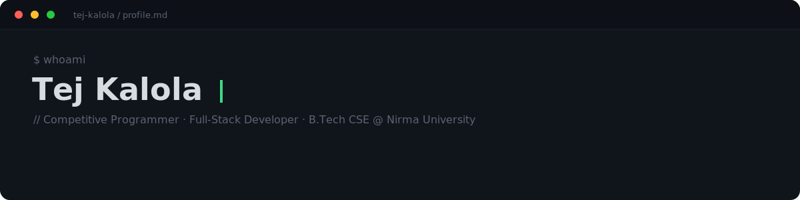

# Hi 👋, I'm Tej Kalola

### 💻 Competitive Programmer 🎓 B.Tech CSE @ Nirma University

  

  

---

# 👨‍💻 About Me

- 🎓 B.Tech Computer Science student at **Nirma University**
- 💻 Competitive Programmer
- 🌐 Learning Full Stack Developement and passionate about building real-world applications
- 🚀 Currently learning **Node.js** and Backend Development
- 📚 Strong interest in Data Structures & Algorithms
- 🤝 Always open to learning, collaboration, and new opportunities

---

# 💡 Developer Philosophy

> **"I believe programming is not just writing code—it's solving real-world problems with simple, efficient and scalable solutions."**

- 💻 Love solving algorithmic challenges
- 🌱 Always learning modern technologies
- 🎯 Focused on writing clean and maintainable code
- 🤝 Open to collaboration and learning

---

# 🏆 Competitive Programming

| Platform | Status |
| :------: | :----: |
| 🔵 Codeforces | **Pupil (1396)** |
| 🟡 LeetCode | Active Problem Solver |

 

---

# ⚙️ Tech Stack

---

# 📊 GitHub Stats

  

---

# 🐍 Contribution Snake

<picture>

<source
media="(prefers-color-scheme: dark)"
srcset="https://raw.githubusercontent.com/kalolaTej/kalolaTej/output/github-snake-dark.svg">

<source
media="(prefers-color-scheme: light)"
srcset="https://raw.githubusercontent.com/kalolaTej/kalolaTej/output/github-snake.svg">

</picture>

---

# 📫 Connect With Me

---

### ⭐ Thanks for visiting my profile!

*"Keep Learning • Keep Building • Keep Growing."*

